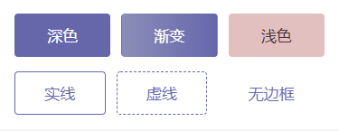
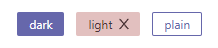
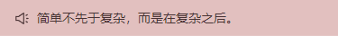

# 色彩

说到色彩，作为非设计专业理工人，是不敢瞎造次的。

这里不得不提到的就是 [Ant Design](https://ant.design/docs/spec/colors-cn)，它是我见过的好好搞色彩的大众 UI 库了，已经演化出 3 个版本了，具体可以看这篇文章 [Ant Design 色板生成算法演进之路](https://zhuanlan.zhihu.com/p/32422584)。

秉承着开源精神， 组件库使用了 Ant Design 的色卡算法，同时加入了一点自己的思考。

## 默认主题

我们采用了传统组件库类型系统，分为 `default`, `primary`, `success`, `warning`, `danger` 五种类型，分别有五种色彩对应。

其中 `default` 直接复用了 Ant Design 灰度色卡。其他颜色则是从 [潘通年度代表色](http://www.pantone.net.cn/pantone/coloryeardetail.htm?ID=c4b893fb5ad84fc99cb971d01a66584f&language=CN) 中选取。

| type    | color   |
| ------- | ------- |
| primary | #0f4c82 |
| success | #3c9052 |
| warning | #bb9445 |
| danger  | #b1262d |

## 主题定制

组件库的样式是基于 SCSS 开发的，可以通过提供的工具完成主题的个性化定制，主要是色彩相关。

在主题定制之前，推荐通过 [色卡](https://godxiaoji.github.io/vfox/demo/#/ColorCard) 查看下你钟意的颜色在色卡中的效果。推荐颜色值在 HSV 模式下 **S > 70% 且 V > 70%**。

1. 打开 [主题定制](https://godxiaoji.github.io/vfox/demo/#/CustomTheme) 工具，按操作完成定制并复制定制后的代码。
2. 新建自定义 SCSS 文件 `my-style.scss`，粘贴定制代码，如：

   `my-style.scss` :

   ```Scss
   $primary-color-2: #c5c6d1;
   $primary-color-5: #6667ab;
   $primary-color-6: #4a4985;
   $primary-color-7: #312f5e;
   $primary-color: $primary-color-6;
   $success-color-2: #a3b6a6;
   $success-color-5: #3c9052;
   $success-color-6: #276a3b;
   $success-color-7: #154425;
   $success-color: $success-color-6;
   $warning-color-2: #e1d9bf;
   $warning-color-5: #bb9445;
   $warning-color-6: #95702f;
   $warning-color-7: #6e4e1e;
   $warning-color: $warning-color-6;
   $danger-color-2: #d79996;
   $danger-color-5: #b1262d;
   $danger-color-6: #8b1721;
   $danger-color-7: #650c16;
   $danger-color: $danger-color-6;
   ```

3. 更改原来引入的样式文件：

```JavaScript
import Vfox from 'vfox'

// delete: vfox/es/style/index.css
import 'path/to/my-style.scss'
import 'vfox/es/style/index.scss'

app.use(Vfox)
```

4. 安装 scss 依赖

**Vite** 只需要预装 sass 预处理器，具体请参阅 [CSS Pre-processors](https://cn.vitejs.dev/guide/features.html#css-pre-processors)。

```
npm install -D sass
```

**Vue CLI** 还需要相应的 loader，具体请参阅 [预处理器](https://cli.vuejs.org/zh/guide/css.html#%E9%A2%84%E5%A4%84%E7%90%86%E5%99%A8)。

```
npm install -D sass-loader sass
```

## 自定义色彩

前面提到了 Ant Design 的色卡算法，在部分组件都有相应的应用，比如 `Button`, `Tag`, `NoticeBar`, `Badge`, `Avatar`。

除了主题自带的四种颜色，同时也支持单独颜色自定义，和其他 UI 库 不同的是，只需要传入一种颜色就可以完成整个组件的效果渲染。如：2022 年流行色 **长春花色** 和 **莲花色**。

`Button` :



`Tag` :



`NoticeBar` :




上图展示深色组件和浅色组件的呈现效果。

只要传入一个主要颜色，组件内置算法会帮你算出其他配套的色彩，包括不限于背景色，前景色，渐变色，点击态，深色浅色区分等。

### 颜色值格式

颜色值的要求也是比较宽泛，除了最简单的 hex，如 `#ffffff`，其他的 `rgb(255, 255, 255)`，`hsl(0deg, 0%, 0%)` 等 CSS 支持的规范也可以支持。

主要得益于引入了一个颜色库 [colorfuls](https://github.com/godxiaoji/colorfuls)，没错，这也是我写的。其他像非 WEB 的格式如 `HSB`, `CMYK` 也是可以的，详见其文档。

当然在自定义色彩这里，是忽略不透明值的。
